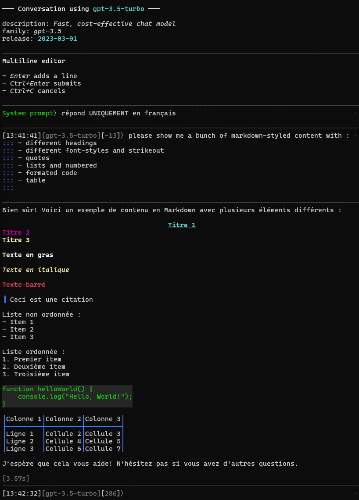

# CLI Chatbot (OpenAI)

Simple chatbot en ligne de commande (CLI) en Rust, utilisant l’API OpenAI (publique ou privée).

Sample rendering for WEB in light mode


Sample rendering for CLI in dark mode



A noter que la majorité du code a été écrit par Claude.ai, ue j'ai utilisé ChatGPT pour plein de trucs, et que je me suis amusé à nettoyer/refactorer/améliorer pour ce qui en valait la peine à mon avis (principalement la robustesse).

---

## Installation

Les binaires sont générés automatiquement à chaque release.

### 📦 Télécharger un binaire

1. Aller sur la [page des releases)(https://github.com/nipil/openai-compatible-chat/releases)

2. Télécharger l’archive correspondant à votre système :
   - 🪟 Windows : `chatbot-x86_64-pc-windows-msvc.zip`
   - 🐧 Linux : `chatbot-x86_64-unknown-linux-gnu.tar.gz`
   - 🍎 macOS : `chatbot-aarch64-apple-darwin.tar.gz` (Apple Silicon)
   - 🍎 macOS : `chatbot-x86_64-apple-darwin.tar.gz` (Intel)

3. Extraire l’archive

---

### 🪟 Windows

- Extraire le `.zip`
- Lancer le binaire :

```powershell
.\chatbot.exe
```

---

### 🐧 Linux / 🍎 macOS

- Extraire l’archive :

```bash
tar -xzf chatbot-*.tar.gz
cd chatbot-*
```

- Rendre le binaire exécutable (si nécessaire) :

```bash
chmod +x chatbot
```

- Lancer :

```bash
./chatbot
```

---

## Mise à jour

Télécharger simplement la dernière version depuis la page des releases et remplacer l’ancien binaire.

---

## Configuration

Créer un fichier `config.json` dans le même dossier que le binaire :

```json
{
  "api_key": "YOUR_API_KEY",
  "base_url": "https://api.openai.com/v1",
  "exclude_model_name_regex": ["realtime", "audio"],
  "prepend_system_prompt": "You are a concise assistant."
}
```

---

## Lancement

```bash
./chatbot
```

(Sur Windows : `chatbot.exe`)

---

### Sélection directe du modèle

Vous pouvez bypass le menu de sélection avec :

```bash
./chatbot --model gpt-4o
```

Comportement :

- vérifie que le modèle existe dans la liste récupérée via l’API
- applique les filtres (exclusions + regex)
- si valide → démarrage direct de la conversation
- sinon → message d’erreur + retour au menu

---

## Fonctionnalités

- sélection interactive du modèle
- streaming des réponses
- historique conversationnel
- estimation des tokens (`~`)
- filtrage des modèles (regex + exclusions automatiques)
- gestion des erreurs (modèle interdit, dépassement contexte)

---

## Notes

- `CTRL-C` : quitter proprement
- dépassement de contexte → conversation verrouillée
- les modèles non autorisés pour la clé API fournie sont ajoutés automatiquement à `exclusion.json`

## Workflow de dev

Installer les prérequis

```shell
# toolchain wasm
rustup target add wasm32-unknown-unknown

# outil qui hot-build/reload le wasm et le static
cargo install trunk

# outil qui hot-build/reload le code natif
cargo install watchexec-cli
```

### Model infos

Il faut garder les fichiers json dans `ai_model_info` à jour, car ils sont utilisés en tant que métadonnées pour filtrer quels modèles utiliser pour chaque fonction.

Cependant, ces données ne sont pas disponibles de manière officielles et centralisées, et il faut les mettre à jour périodiquement pour ajouter les nouveaux modèles (que l'api remonte) en utilisant des données publiques.

Personnellement, j'utilise le workflow suivant pour faire mettre à jour les infos

- utiliser [Claude.ia](https://claude.ai) car il a accès à internet... et fait le boulot
- pour un fichier d'infos de modèles pour lequel il y a des évolutions à faire
  - extraire de chaque fichier json tous les modèles **incomplets** (avec des null)
  - obtenir la liste des *id* modèle récupérés pour lesquels on a pas d'info (cf. logs)

Lui *Ctrl-V le lot de JSON incomplets*, avant de faire votre demande.

Et soumettre le "prompt" ci-dessous avec votre liste de modèles manquants :

    Can you please update my attached incomplete json model metadata compilation WITH ACCURATE DATA (no hallucinating !!) from up-to-date sources, for all AI model id listed below, which i just got from the AI prover API

    ```
    gpt-5.4-nano-2026-03-17
    gpt-5.4-mini-2026-03-17
    ```

Attendre, et claquer son résultat dans le fichier json d'origine.

Puis, exécuter la commande ci-dessous pour **pretty-fier les json**,ce qui permet lors des commits d'avoir un diff propre, qui peut être analysé pour suivre les changements.

```bash
cargo run -p ai_model_info ai_model_info
```

**Revoir les modifications** apportées, vérifier qu'elles sont "cohérentes".

Copier le récapitulatif des actions de Claude (utiliser le bouton "copy" pour récupérer **au format markdown !**)

Commiter en s'assurant de bien **archiver l'explication** de Claude au message de commit

### Debug

Démarre le backend (prendre le port de `wasm/Trunk.toml [[proxy]] backend`)

```shell
watchexec --clear --quiet --restart --debounce 1s --stop-signal SIGTERM --ignore "wasm/**" --exts rs cargo run -p native -- web --port 3000
```

Hot-build et reload du code rust/wasm et serveur du static

```shell
cd wasm
watchexec --clear --quiet --restart --debounce 1s --stop-signal SIGTERM --watch "../portable" --exts rs trunk serve
```

Hot-build documentation

```shell
watchexec --clear --quiet --restart --debounce 10s --stop-signal SIGTERM --watch Cargo.lock cargo doc --locked
```

Visiter `http://localhost:8080` dans le navigateur

### Release

```shell
cd wasm && trunk build --release
```

```shell
cd ..
cargo build --release
```

## Architecture



That's the entire stack:

- Axum + async-openapi on the back
- Leptos + Trunk on the front.

No database, no auth middleware, no extra complexity.

### Backend: Axum

It's the simplest, most modern Rust web framework. Lightweight, built on Tokio, and has excellent support for streaming responses via SSE (Server-Sent Events). It will serve two purposes: proxying requests to OpenAI (keeping your API key server-side), and serving the compiled WASM frontend as static files.

### Frontend: Leptos

The best choice for a simple reactive SPA in Rust/WASM right now. It has a clean component model, handles async and reactive state elegantly, and its compiled output is very small. You won't need a router, so you'll only use its core reactivity and component system.

### Build tooling: Trunk

The standard tool for building and bundling Rust WASM frontends. It handles the WASM compilation, asset pipeline, and dev server with hot-reload out of the box. Zero config for a simple project like this.

### Application flow

The streaming flow will be: Leptos frontend sends a fetch request → Axum backend forwards it to OpenAI with streaming enabled → Axum streams tokens back as SSE → Leptos reads the SSE stream and appends tokens to the UI reactively.

## What's next ?

There is surely [something fun to do !](docs/TODO.md)
