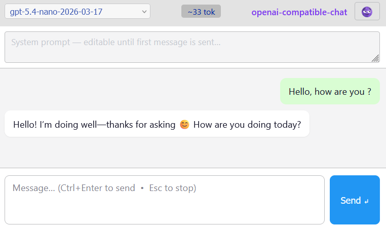
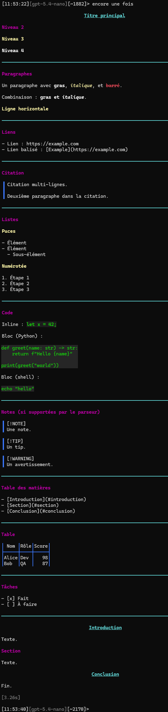

# CLI Chatbot (OpenAI)

Simple chatbot en ligne de commande (CLI) en Rust, utilisant l’API OpenAI (publique ou privée).

Sample rendering for WEB in light mode



Sample rendering for CLI in dark mode



---

## Installation

Les binaires sont générés automatiquement à chaque release.

### 📦 Télécharger un binaire

1. Aller sur la page des releases :  
   <https://github.com/><repo>/releases

2. Télécharger l’archive correspondant à votre système :
   - 🪟 Windows : `chatbot-x86_64-pc-windows-msvc.zip`
   - 🐧 Linux : `chatbot-x86_64-unknown-linux-gnu.tar.gz`
   - 🍎 macOS : `chatbot-aarch64-apple-darwin.tar.gz` (Apple Silicon)
   - 🍎 macOS : `chatbot-x86_64-apple-darwin.tar.gz` (Intel)

3. Extraire l’archive

---

### 🪟 Windows

- Extraire le `.zip`
- Lancer le binaire :

```powershell
.\chatbot.exe
```

---

### 🐧 Linux / 🍎 macOS

- Extraire l’archive :

```bash
tar -xzf chatbot-*.tar.gz
cd chatbot-*
```

- Rendre le binaire exécutable (si nécessaire) :

```bash
chmod +x chatbot
```

- Lancer :

```bash
./chatbot
```

---

## Mise à jour

Télécharger simplement la dernière version depuis la page des releases et remplacer l’ancien binaire.

---

## Configuration

Créer un fichier `config.json` dans le même dossier que le binaire :

```json
{
  "api_key": "YOUR_API_KEY",
  "base_url": "https://api.openai.com/v1",
  "exclude_model_name_regex": ["realtime", "audio"],
  "prepend_system_prompt": "You are a concise assistant."
}
```

---

## Lancement

```bash
./chatbot
```

(Sur Windows : `chatbot.exe`)

---

### Sélection directe du modèle

Vous pouvez bypass le menu de sélection avec :

```bash
./chatbot --model gpt-4o
```

Comportement :

- vérifie que le modèle existe dans la liste récupérée via l’API
- applique les filtres (exclusions + regex)
- si valide → démarrage direct de la conversation
- sinon → message d’erreur + retour au menu

---

## Fonctionnalités

- sélection interactive du modèle
- streaming des réponses
- historique conversationnel
- estimation des tokens (`~`)
- filtrage des modèles (regex + exclusions automatiques)
- gestion des erreurs (modèle interdit, dépassement contexte)

---

## Notes

- `CTRL-C` : quitter proprement
- dépassement de contexte → conversation verrouillée
- les modèles non autorisés pour la clé API fournie sont ajoutés automatiquement à `exclusion.json`

## Workflow de dev

Installer les prérequis

```shell
# toolchain wasm
rustup target add wasm32-unknown-unknown

# outil qui hot-build/reload le wasm et le static
cargo install trunk
```

Démarre le backend (prendre le port de `wasm/Trunk.toml [[proxy]] backend`

```shell
cargo run -- web --port 3000
```

Hot-build et reload du code rust/wasm et serveur du static

```shell
cd wasm && trunk serve
```

Visiter `http://localhost:8080` dans le navigateur
